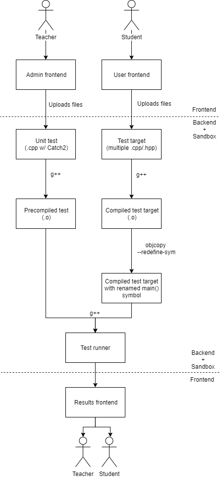

🔑 Contest-like system for testing simple C++ programs w/ unit-tests inside docker 🐳

It's made specifically to make teaching C++ easier,
automating such tasks as checking and testing solutions for C++ assignments.

Usual workflow is:

* Teacher uploads new unit-test for task (assignment) in form of a single `.cpp` file.
* Students upload their solutions in form of a single/multiple `.cpp`/`.h` files.
* Solution compiled and tested against selected tests; any errors during compilation, linking or testing reported to students/teacher.



## Production environment

Create `.env` to specify env variables for both frontend and backend (see `.env.dev` for reference).
Especially specify public path and auth endpoint to use.
For deployment, use `docker-compose.yml` combined with `docker-compose.prod.yml`:

```shell
$ docker-compose up --build -d database
$ docker-compose up --build -d backend
$ docker-compose up --build -d frontend
```

## Development environment

Run `database` via docker-compose, using `docker-compose.dev.yml`:

```shell
$ docker-compose -f docker-compose.yml -f docker-compose.dev.yml up --build -d database
```

Run `backend` with dev config (`./backend/.config.dev.js`):
```shell
$ cd backend
$ node src/index --config .config.dev.js
```

Run `frontend` via webpack-dev-server:
```shell
$ cd frontend
$ npm start
```

`frontend` proxies calls to `backend` on `/api/v1/` endpoint and mocks auth api on `/auth/user_data.php` ([frontend/mock-api/mock-api.js](frontend/mock-api/mock-api.js)).

